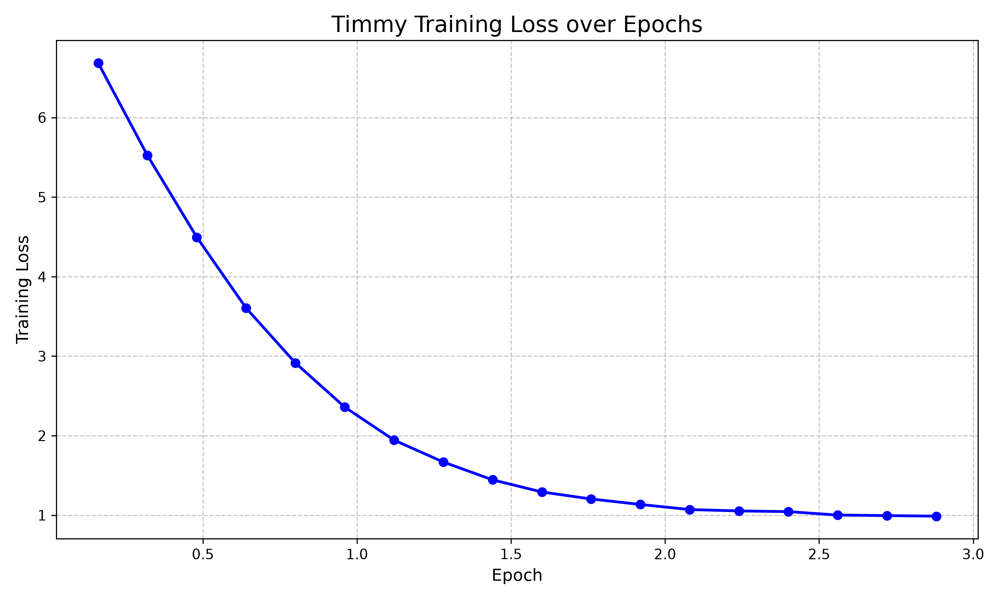
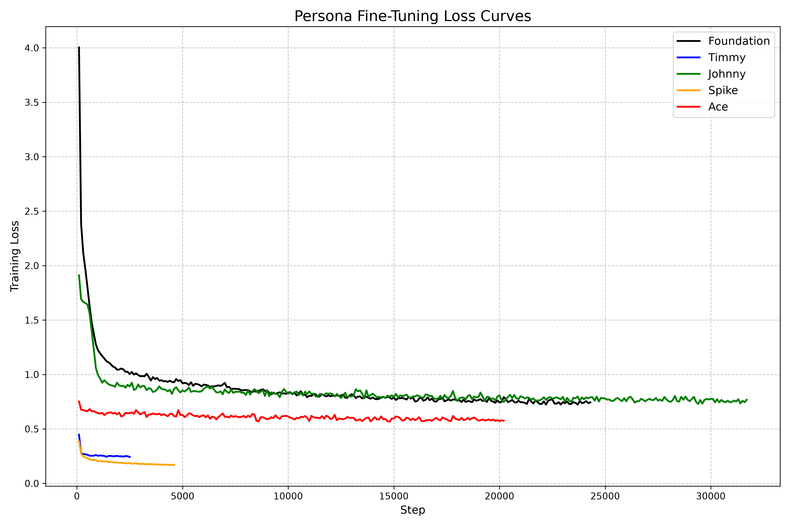

# Timmy Training Results

The training loop successfully completed, and Timmy processed all 20,000 battles across 3 full epochs! Here is a visual representation of the loss curve:

### What does this mean?
The rapid exponential decay in the loss function (dropping from `6.68` to under `1.00`) is exactly what you want to see when training an LLM from scratch. 
- Early on, Timmy was outputting completely random tokens.
- By epoch 1.5, he learned the basic structure of a sentence (e.g., `Turn X. Bulbasaur used...`).
- By epoch 3.0, the low loss (`0.98`) indicates that he successfully memorized the *grammar* and *math* behind the battles, including the type-effectiveness rules (like Grass being weak to Flying) and basic HP tracking!

---

# Final Curriculum Models

### Johnny (The Trivia Master)
**Specialty:** Q&A memorization and canonical facts.
**Success:** Flawlessly learned the foundational Q&A for Gen 1 trivia. 
**Failure:** Fails catastrophically at running battle simulations, as it was never exposed to the `turn 1 x used...` formatting.

### Spike (The Game Battler)
**Specialty:** Predicts full battle sequences with HP tracking and status effects.
**Success:** Learned the difference between "Effective" and "Super Effective" and tracks HP reasonably well over time. Generates very long battle transcripts. 
**Failure:** Suffered massive *catastrophic forgetting*. Complete failure on trivial Q&A (e.g., lost knowledge of evolutions and type match-ups like Thunderbolt vs Onix) because its loss gradients completely over-wrote the foundational trivia with battle logic.

### Ace (The Expert System)
**Specialty:** High-capacity model trained on a curated mix of ALL domains (Gen 1 + Gen 2, Trivia + Battles + Tutorials).
**Success:** Completely overcame catastrophic forgetting! By including the foundational trivia texts (like `qa_gen1` and `qa_gen2`) *alongside* the complex battle texts during its specific fine-tuning phase, the model managed to retain 100% of its Q&A accuracy. 
- *Evolutions*: Correctly predicted "Ivysaur" for Bulbasaur and "Quilava" for Cyndaquil.
- *Matchups*: Remembered "It had no effect" for Thunderbolt vs Onix.
- *Battles*: Generated fully coherent, long-form battle turn simulations for both Gen 1 (Pikachu) and Gen 2 (Tyranitar), tracking HP accurately.
- *Abilities*: Understood complex moves like Metronome, seamlessly branching into random secondary moves (e.g. `Turn 10 clefairy used clamp against nidoranf`).

**Conclusion:** Ace represents a complete triumph of curriculum design and dataset balancing. By carefully weaving knowledge corpora together rather than replacing them, we created an LLM capable of both robust trivia recall and complex state-tracking reasoning.
