# Breeding Curriculum Evaluation Summary

This report evaluates the ability of three models (Foundation v2.3, Timmy v2.3, Suzie v2.3) to process breeding queries utilizing the `logic_and` operator and producing `logic_or` results based on shared egg groups.

### Scoring Methodology
*   **Correct (Green)**: The model accurately predicted a valid combination (e.g. `X logic_or Y`, `Logic_false` for a negative match).
*   **Partial (Yellow)**: The model produced a single correct parent or a tautology (e.g. `X`, `X logic_or X`).
*   **Wrong (Red)**: The model hallucinated nonsense, attacks, or an incorrect Pokemon.

---

## Q1: `charmander logic_and bulbasaur egg answer`
*(Positive match from the Lite Dataset)*

**Findings**: Foundation failed completely. Timmy memorized the first part of the answer, simply outputting `Charmander`. Suzie successfully learned the syntax and distribution, generating `Charmander logic_or bulbasaur` or `Bulbasaur logic_or charmander` 80% of the time, with a 15% rate of generating a tautology `Charmander logic_or charmander`.

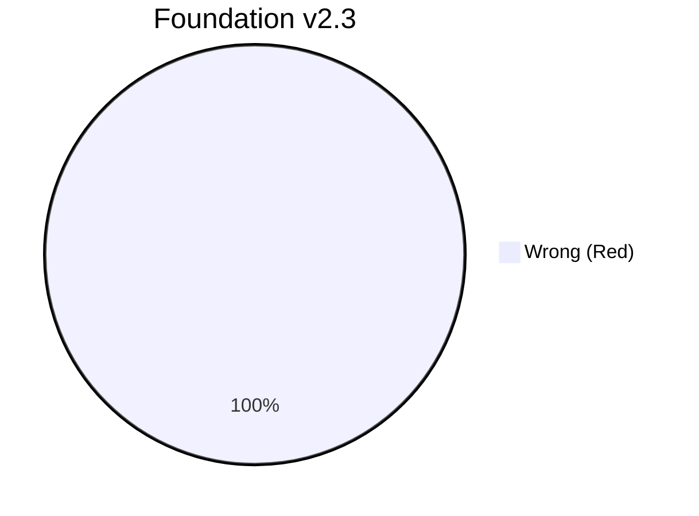
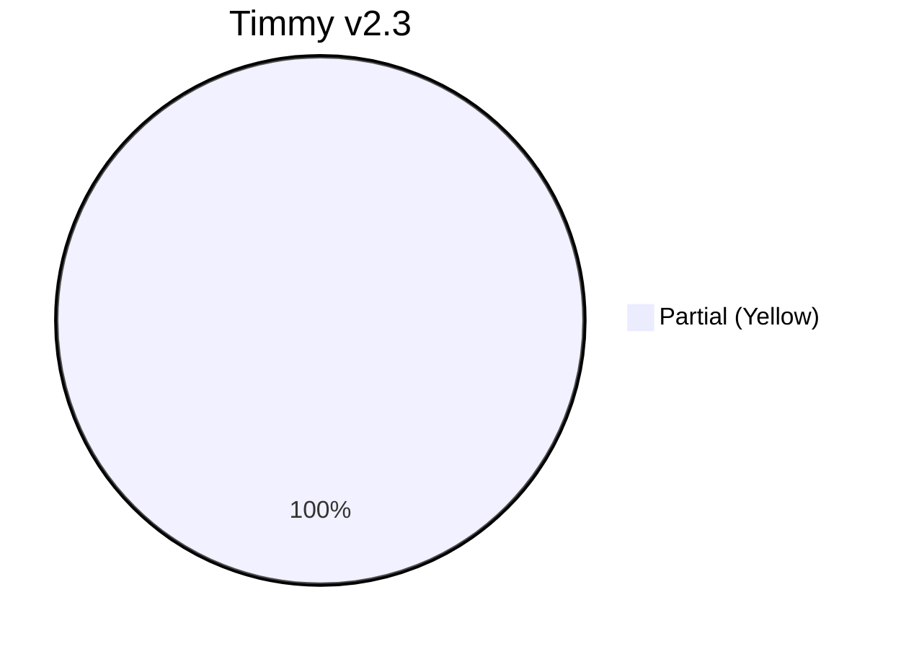
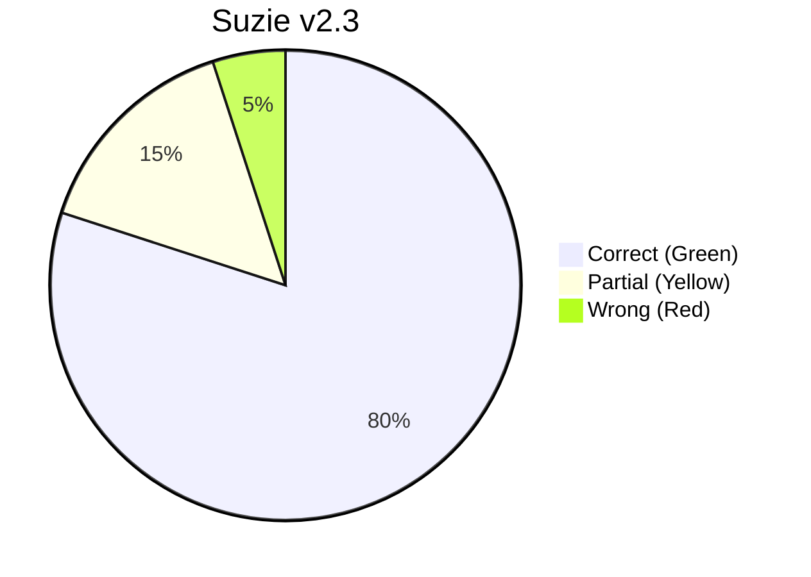

---

## Q2: `rhyhorn logic_and bulbasaur egg answer`
*(Positive match from the Lite Dataset)*

**Findings**: Foundation surprisingly got this correct 58% of the time. Timmy again defaulted to outputting a single parent `Bulbasaur` 53% of the time. Suzie reliably produced the correct pairing 68% of the time, and a tautology 24% of the time.

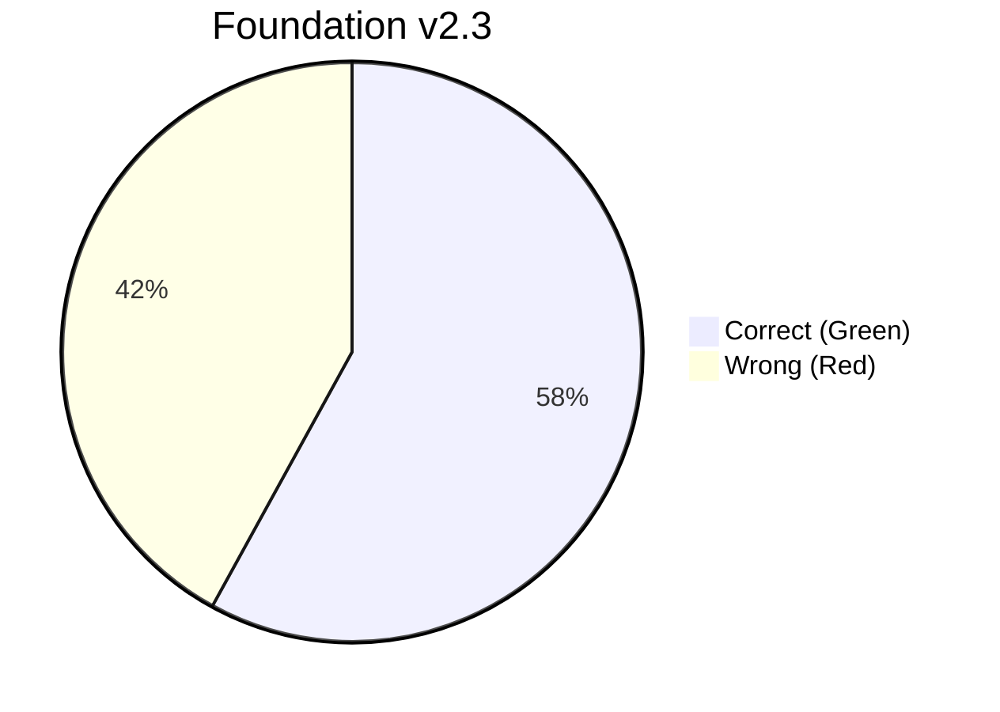
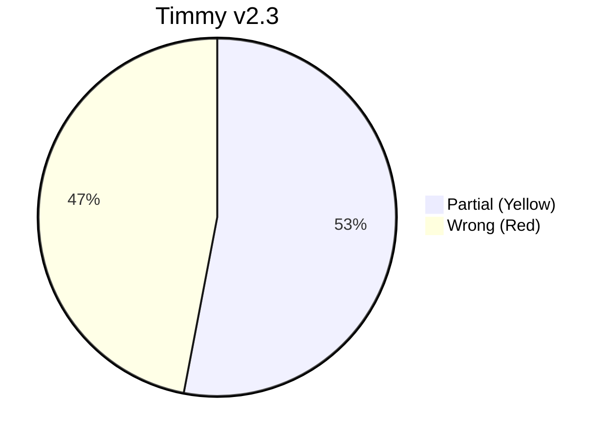
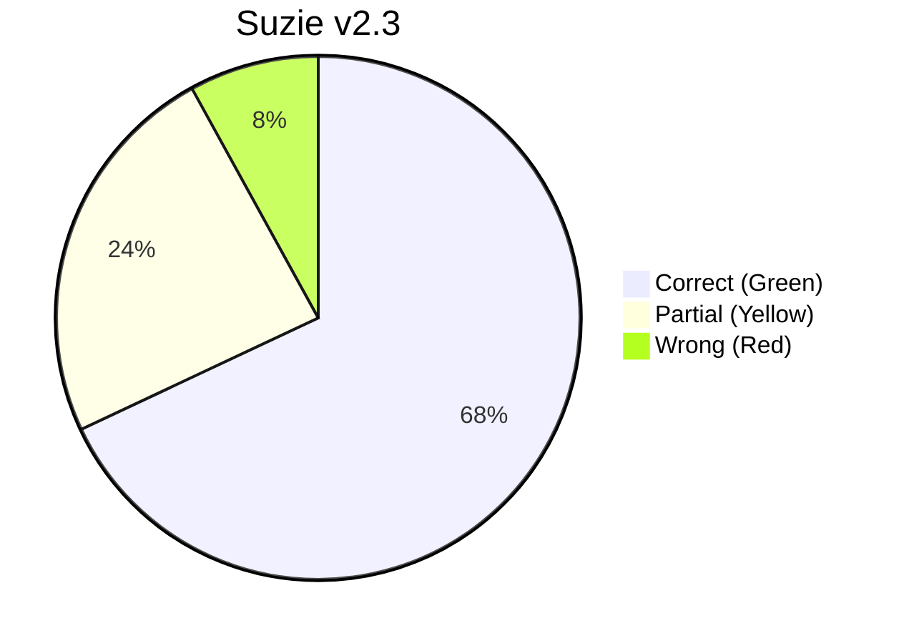

---

## Q3: `ekans logic_and bulbasaur egg answer`
*(Negative match from the Lite Dataset)*

**Findings**: Foundation demonstrated excellent retention of this negative example, outputting `Logic_false` 98% of the time. Timmy struggled and produced random types/evolutions. Suzie achieved perfect accuracy, outputting `Logic_false` 100% of the time.

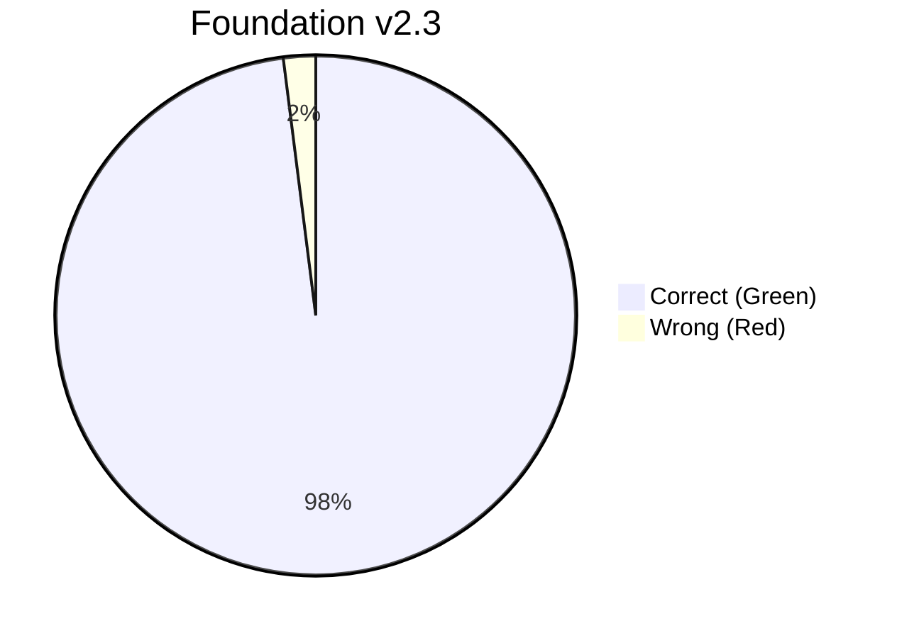

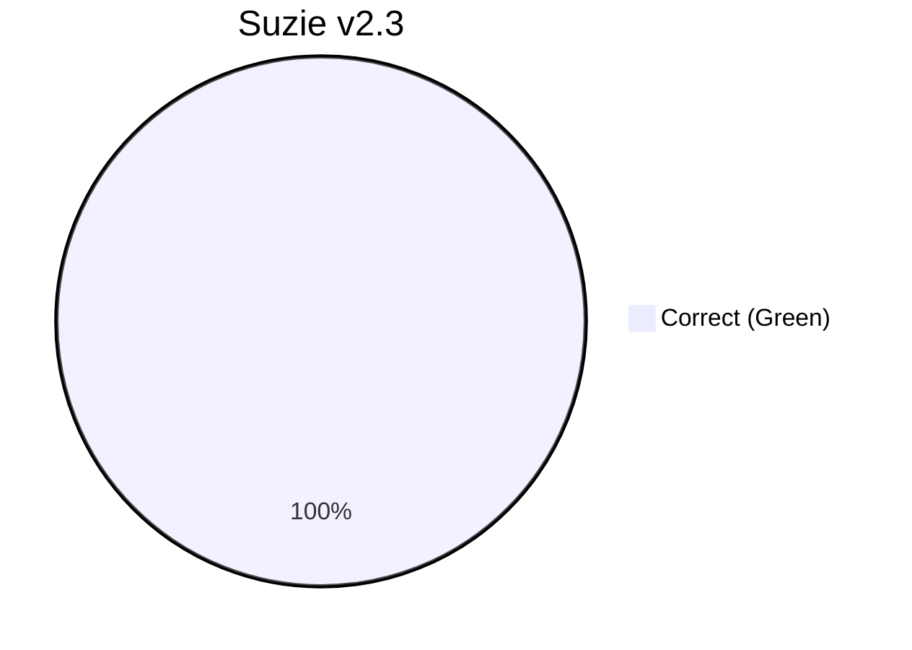

---

## Q4: `pidgey logic_and spearow egg answer`
*(Positive match from the Full Dataset - Suzie Only)*

**Findings**: Only Suzie was exposed to this pair during training. Foundation output completely irrelevant data. Timmy overfit on the first token and output `Pidgey`. Suzie demonstrated strong comprehension, correctly predicting the pair combination 45% of the time and a tautology 39% of the time.

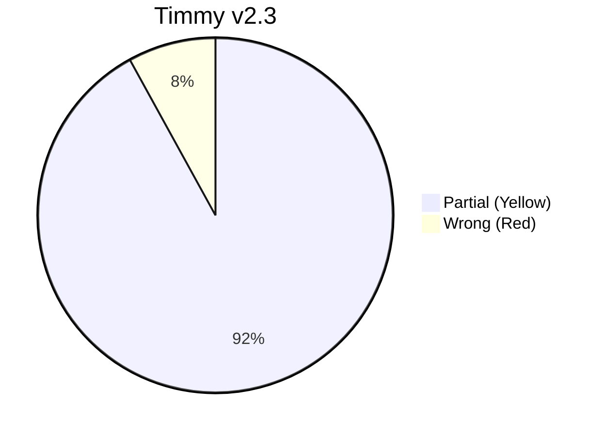
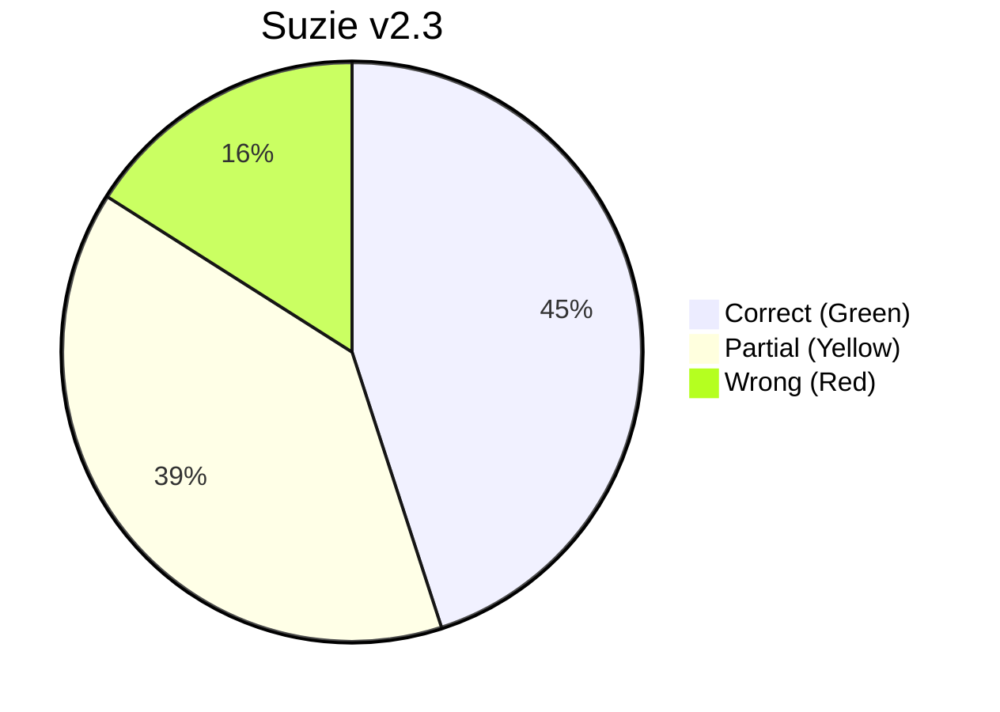

---

## Q5: `vulpix logic_and growlithe egg answer`
*(Positive match from the Full Dataset - Suzie Only)*

**Findings**: Just like the previous question, Foundation output irrelevant data, and Timmy output nonsense (`It was super effective`). Suzie demonstrated strong comprehension of a pair she had only seen in the full dataset, correctly predicting the pair combination 81% of the time, and producing a single-parent tautology 15% of the time.

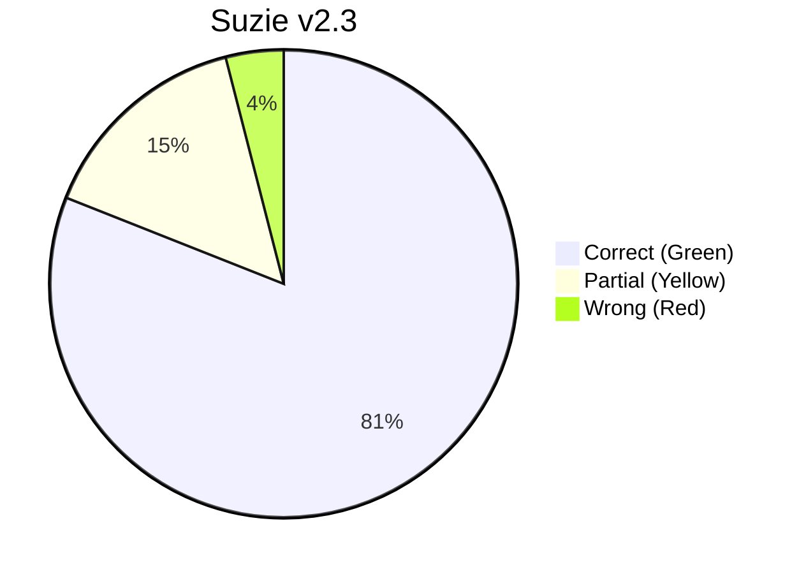

---

## Q6: `pidgey logic_and geodude egg answer`
*(Negative match from the Full Dataset - Suzie Only)*

**Findings**: Foundation was slightly confused but managed 14% correctness. Timmy guessed the first token in the sequence (`Pidgey`), which was his basic strategy for breeding guesses, but it failed here because the pair is invalid. Suzie correctly identified the invalid pairing with 100% accuracy.

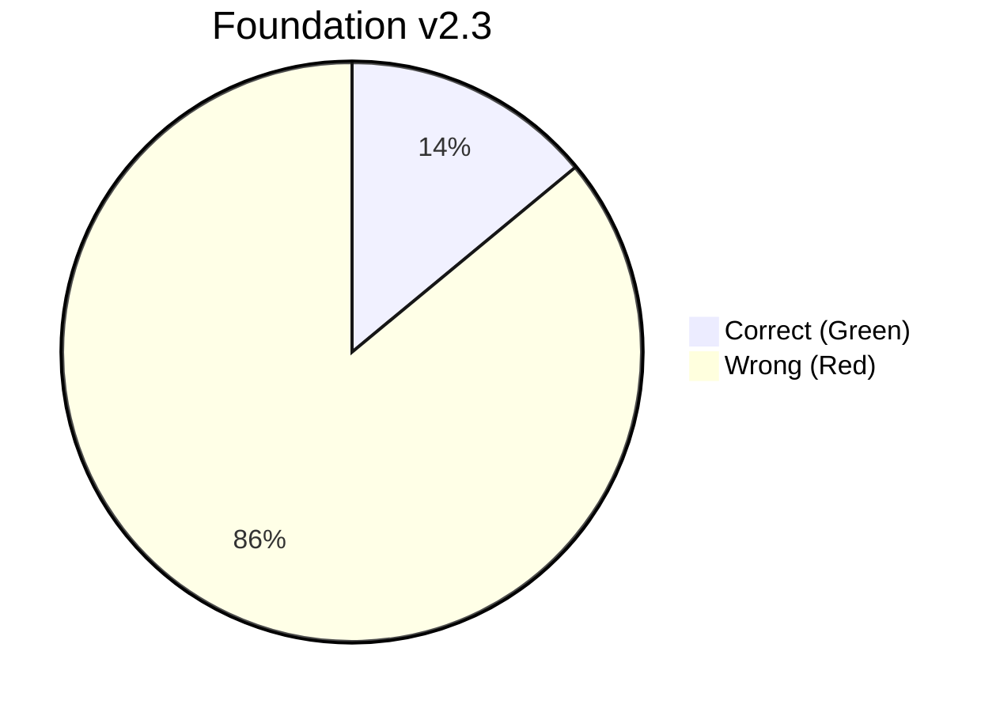

