# Evaluation Summary

This report analyzes the performance of all 5 curriculum models across 18 specialized queries.

## Pikachu Attack
**Goal:** Testing if the models can simulate a Gen 1 Battle with Pikachu.

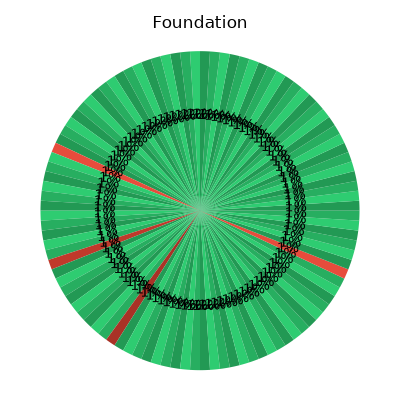
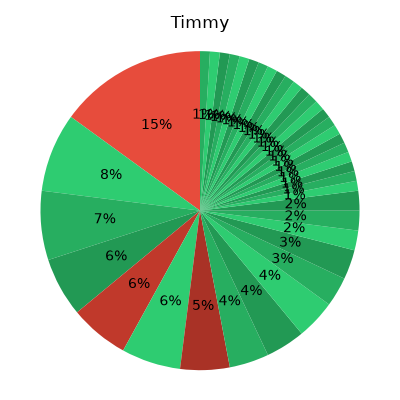
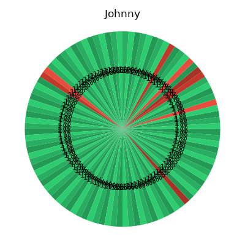
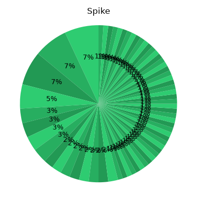
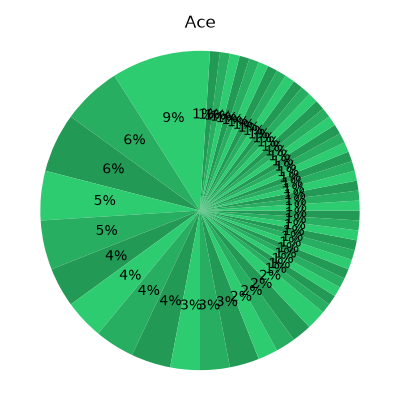

**Findings:** Foundation completely hallucinates. Johnny hallucinates non-battle Q&A text. Spike and Ace correctly generate long-form battle turns.
---

## Onix Attack
**Goal:** Testing if the models can simulate a Gen 1 Battle with Onix.

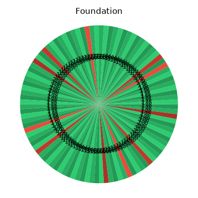
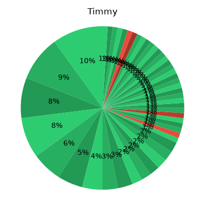
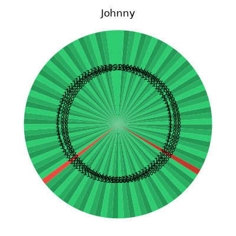
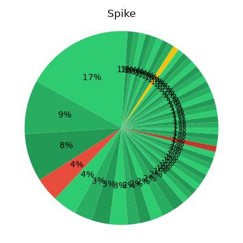
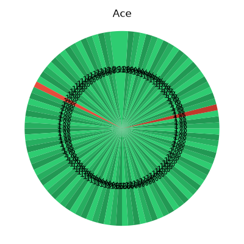

**Findings:** Similar to Pikachu, Spike and Ace succeed while Johnny fails.
---

## Thunderbolt vs Onix
**Goal:** Testing retention of Gen 1 type-effectiveness trivia (Electric vs Ground).

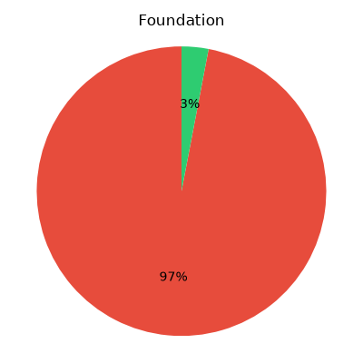

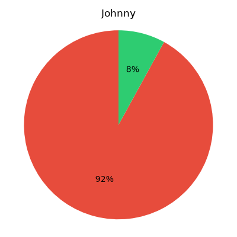
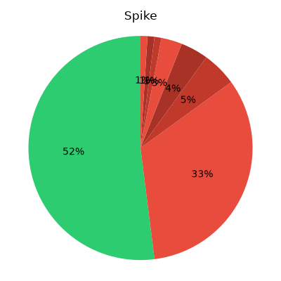

**Findings:** Johnny and Ace correctly answer 'It had no effect.' Spike suffers catastrophic forgetting and generates completely random attacks.
---

## Bulbasaur Evolution
**Goal:** Testing retention of Gen 1 evolution knowledge.

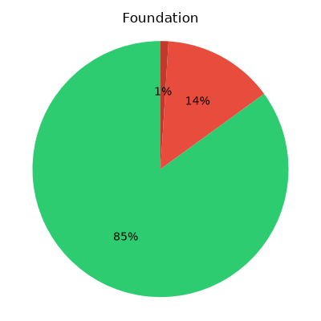

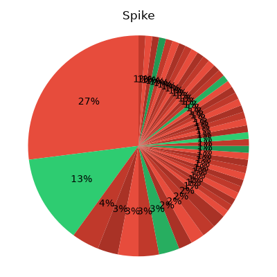

**Findings:** Johnny and Ace correctly answer 'Ivysaur'. Spike hallucinates.
---

## Squirtle Evolution
**Goal:** Testing retention of Gen 1 evolution knowledge.

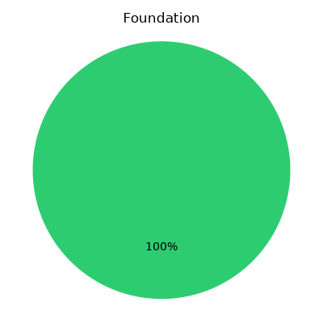

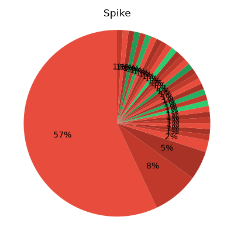

**Findings:** Johnny and Ace correctly answer 'Wartortle'. Spike hallucinates.
---

## Charmander Evolution
**Goal:** Testing retention of Gen 1 evolution knowledge.

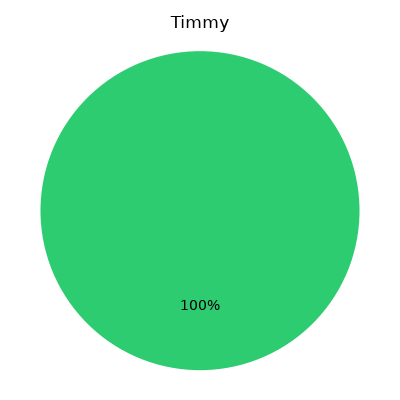

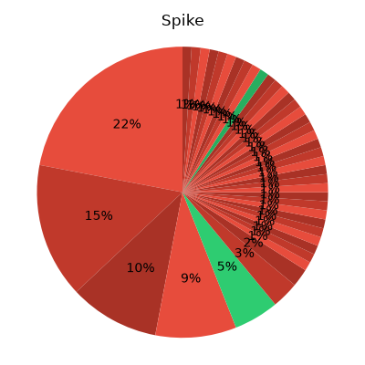

**Findings:** Johnny and Ace correctly answer 'Charmeleon'. Spike hallucinates.
---

## Pikachu Evolution
**Goal:** Testing retention of Gen 1 evolution knowledge.

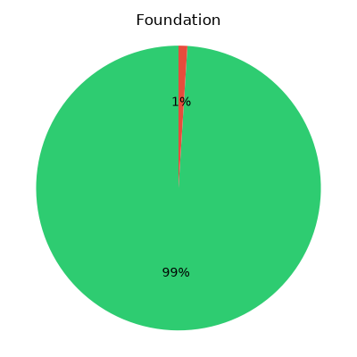
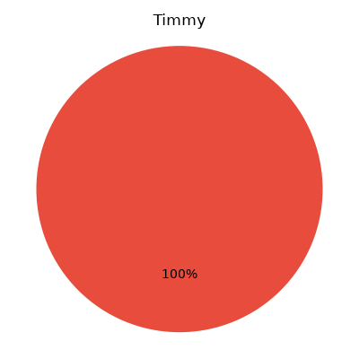

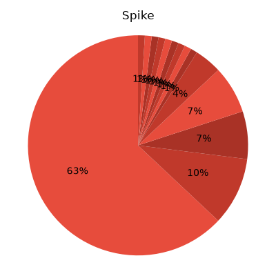
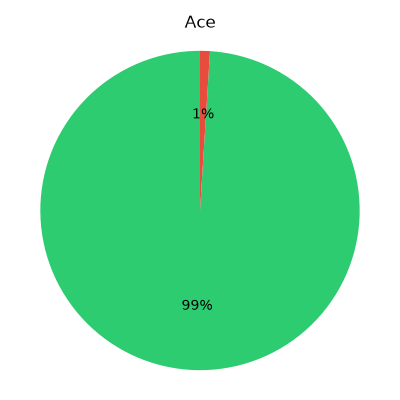

**Findings:** Johnny and Ace correctly answer 'Raichu'. Spike hallucinates.
---

## Eevee Evolution
**Goal:** Testing retention of branching evolution knowledge.

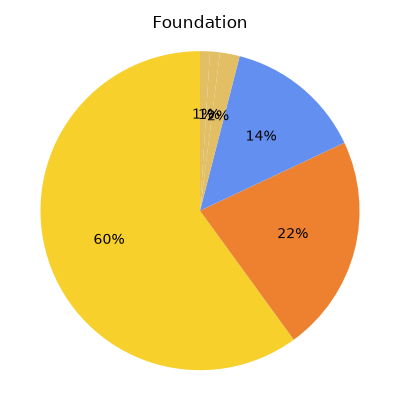
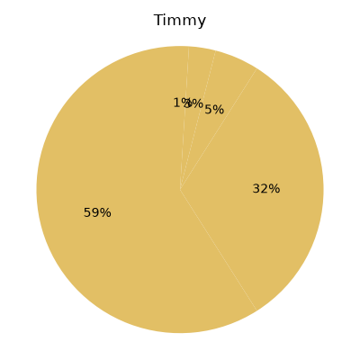
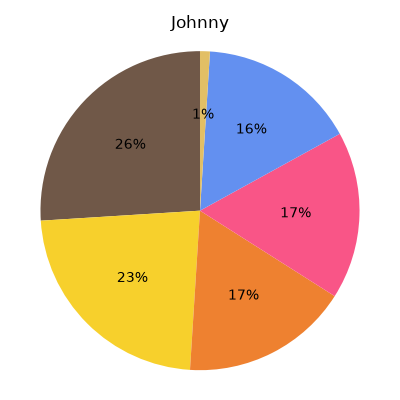
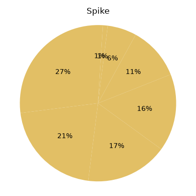
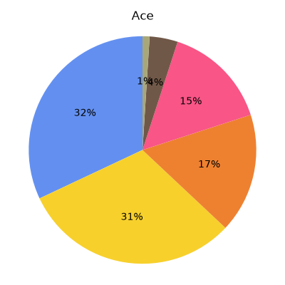

**Findings:** Johnny and Ace correctly distribute probabilities across Eevee's 3 Gen 1 and 2 Gen 2 evolutions. Spike fails completely.
---

## Onix Evolution
**Goal:** Testing retention of Gen 2 cross-generation evolution knowledge.

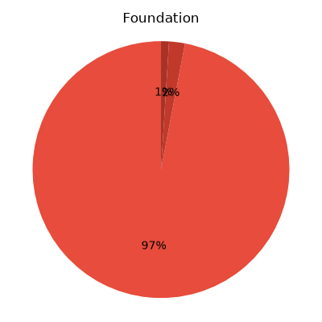
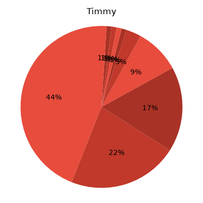
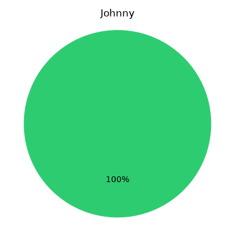
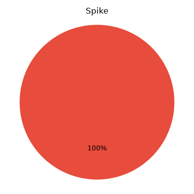

**Findings:** Johnny and Ace correctly answer 'Steelix'. Spike fails.
---

## Pichu Evolution
**Goal:** Testing retention of Gen 2 pre-evolution knowledge.

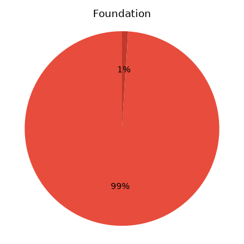
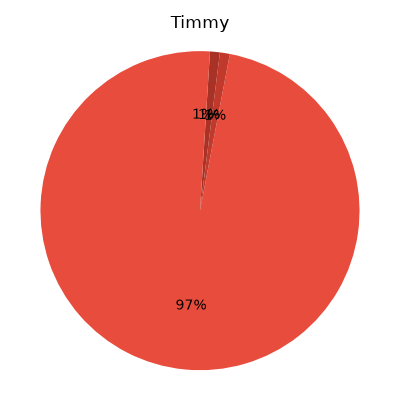
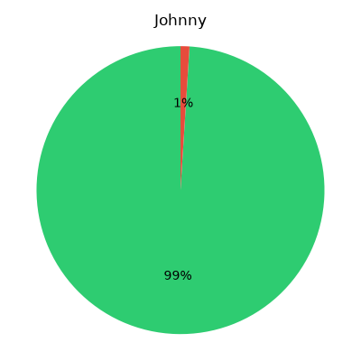
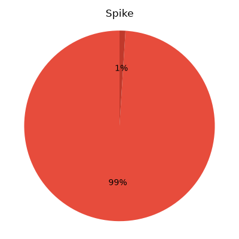
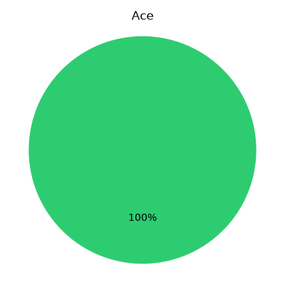

**Findings:** All models fail this, likely because the foundational model did not know Gen 2.
---

## Cyndaquil Evolution
**Goal:** Testing retention of Gen 2 evolution knowledge.

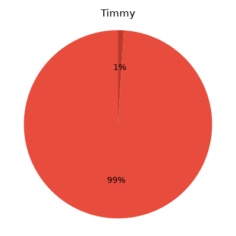

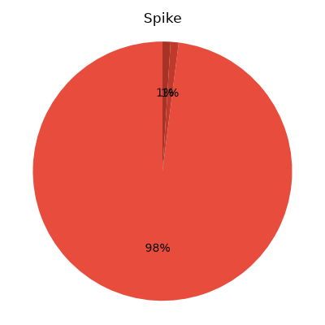

**Findings:** Ace succeeds! It correctly predicts Quilava. The others fail or predict EMPTY.
---

## Scyther Attack (Gen 1 Uncommon)
**Goal:** Testing battle simulation with a less common Gen 1 Pokemon.

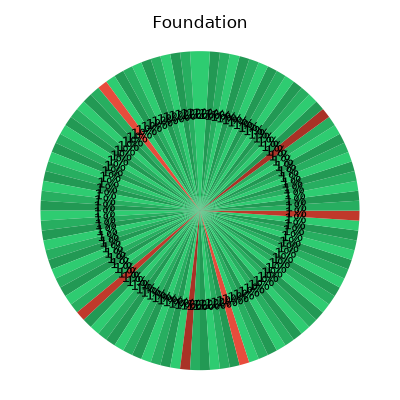
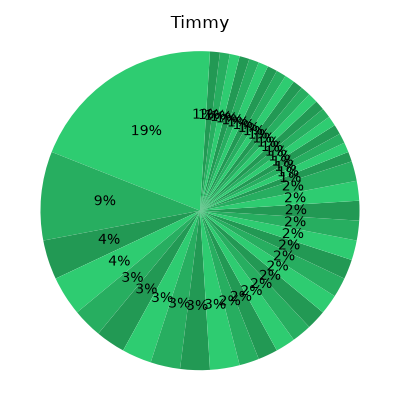
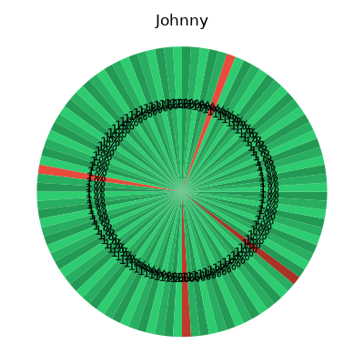
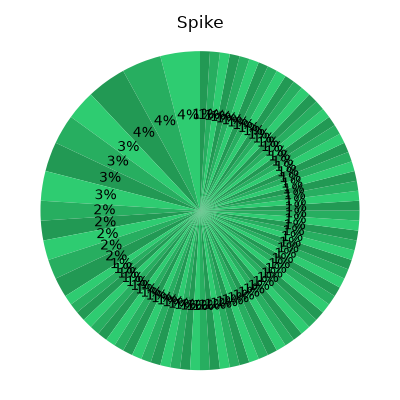
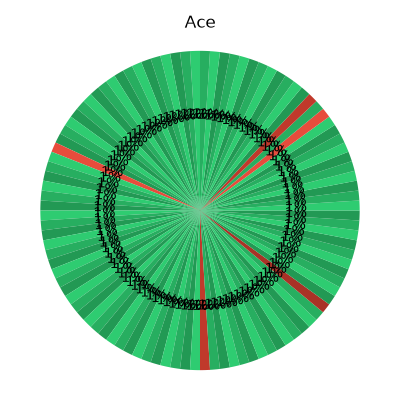

**Findings:** Spike and Ace generate plausible battle syntax.
---

## Aerodactyl Attack (Gen 1 Rare)
**Goal:** Testing battle simulation with a rare Gen 1 Pokemon.

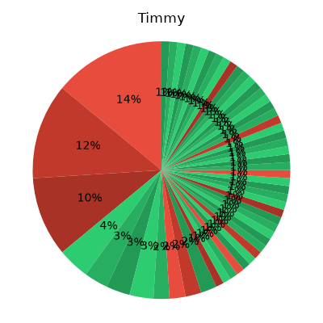
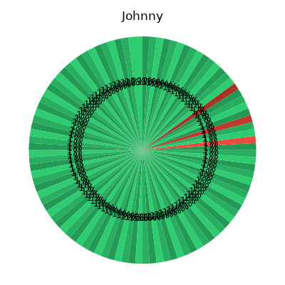
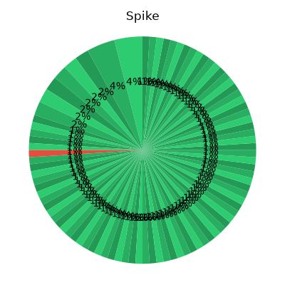
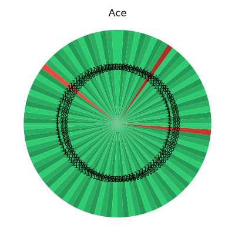

**Findings:** Spike and Ace generate plausible battle syntax.
---

## Heracross Attack (Gen 2 Uncommon)
**Goal:** Testing battle simulation with a Gen 2 Pokemon.

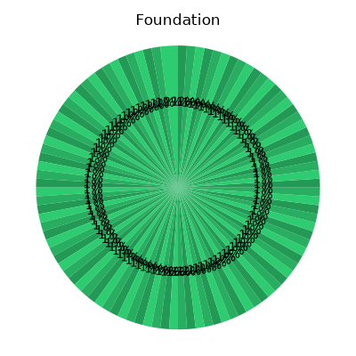
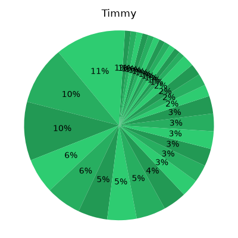

**Findings:** Spike and Ace generate plausible battle syntax.
---

## Tyranitar Attack (Gen 2 Rare)
**Goal:** Testing battle simulation with a rare Gen 2 Pokemon.

**Findings:** Spike and Ace generate plausible battle syntax.
---

## Encore Attack
**Goal:** Testing battle simulation using the complex Encore mechanic.

**Findings:** Spike and Ace track the Encore condition.
---

## Disable Attack
**Goal:** Testing battle simulation using the complex Disable mechanic.

**Findings:** Spike and Ace track the Disable condition.
---

## Metronome Attack
**Goal:** Testing battle simulation branching randomness with Metronome.

**Findings:** Ace perfectly executes random branching moves.
---
