# Evaluation Summary V2

This report analyzes the performance of Johnny v2, Spike v2, and Ace v2 against the algebraic constraints and zero-shot reasoning.

## Negative Logic (Evolution)
**Goal:** Tests if the model learned the explicit `<LOGIC_NOT>` constraint for non-evolving Pokémon.

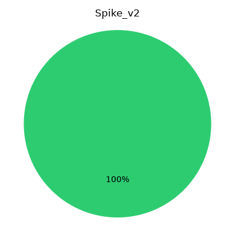
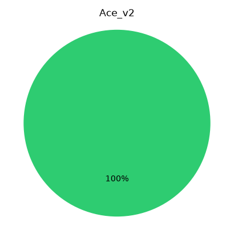

---

## Negative Logic (Restrictive Movesets)
**Goal:** Tests if the model understands negative move exclusion.

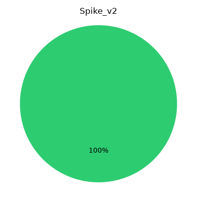
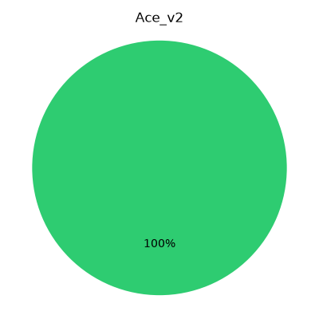

---

## Hatchable Encounters
**Goal:** Tests retention of the new Gen 2 Baby Pokémon token.

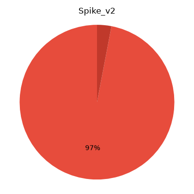
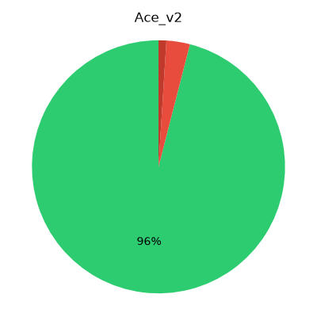

---

## Abstract Move Algebra (Disable)
**Goal:** Tests if the model understands the `<UNKNOWN_MOVE>` algebraic variable for the Disable edge case.

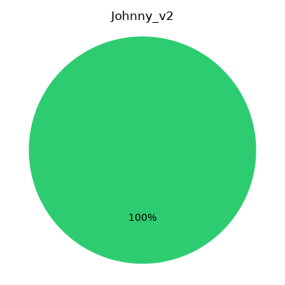
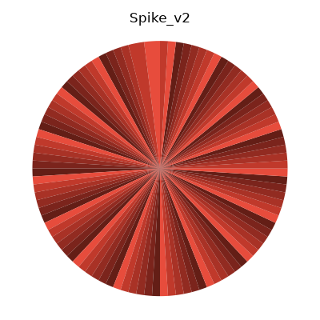
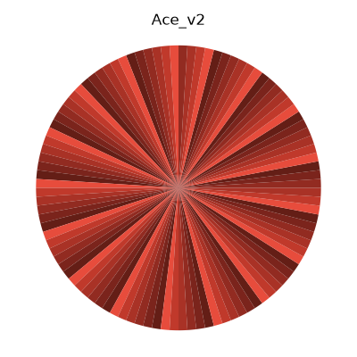

---

## Abstract Move Algebra (Transform)
**Goal:** Tests algebraic variable mapping for shape-shifting moves.

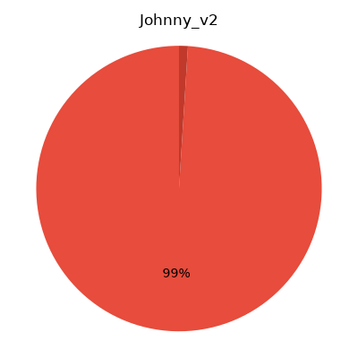
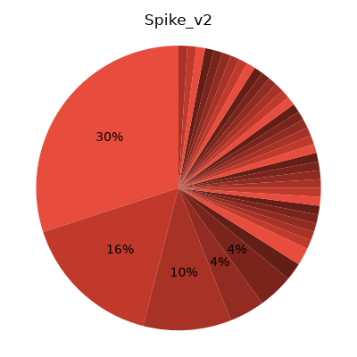
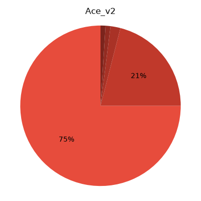

---

## Action Prevention (Status Overwrite)
**Goal:** Tests abstract action prevention logic.

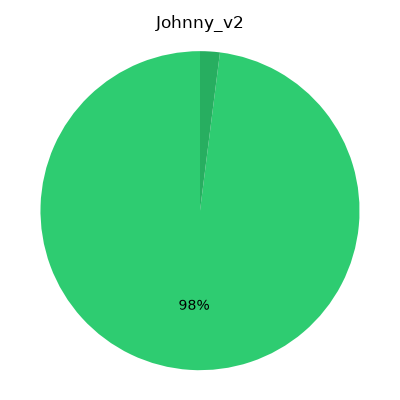
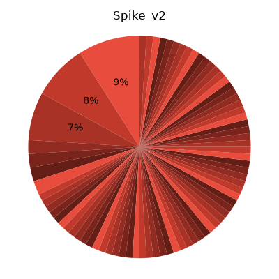

---

## Zero-Shot Dual-Type Calculation
**Goal:** Tests if the model can dynamically calculate that Ghost has no effect on Normal/Flying.

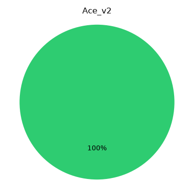

---

## Zero-Shot Steel Matchup
**Goal:** Tests the new Gen 2 Steel typings (Steel vs Electric/Steel).

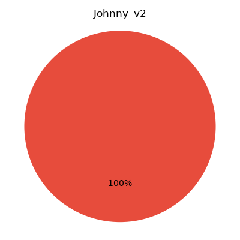

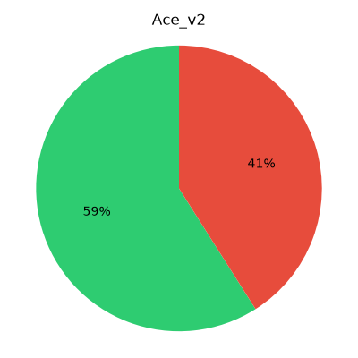

---

## MinMax Status Redundancy (Battle Engine)
**Goal:** Tests if Ace v2 learned the MinMax rule to never use a status move on a Pokémon that is already afflicted.

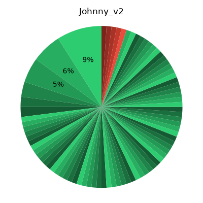
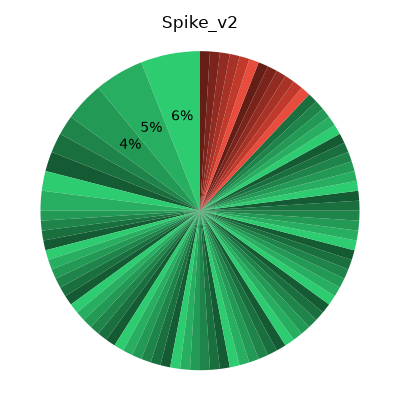
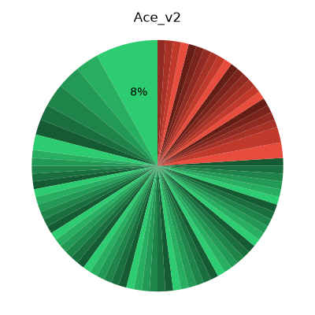

---

## MinMax Base Test
**Goal:** Tests if Ace v2 correctly calculates Charizard fainting and issues Leader Battle Score.

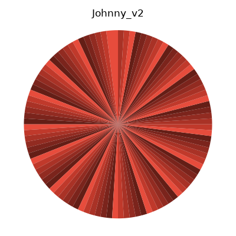
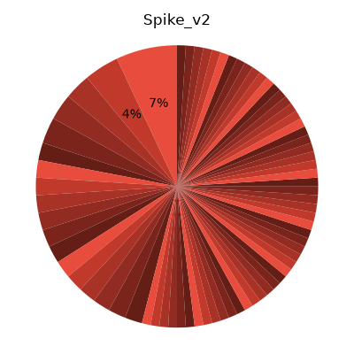
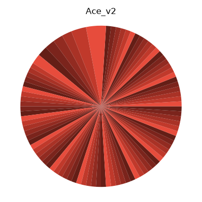

---

## Thunderbolt vs Onix
**Goal:** Testing retention of Gen 1 type-effectiveness trivia (Electric vs Ground).

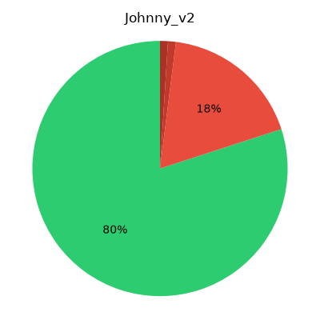
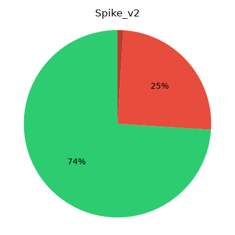
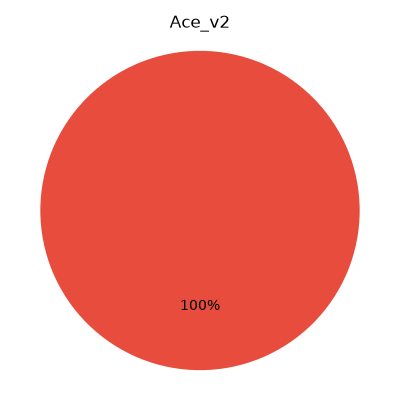

---

## Encore Attack
**Goal:** Testing battle simulation using the complex Encore mechanic.

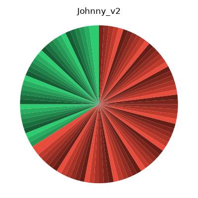
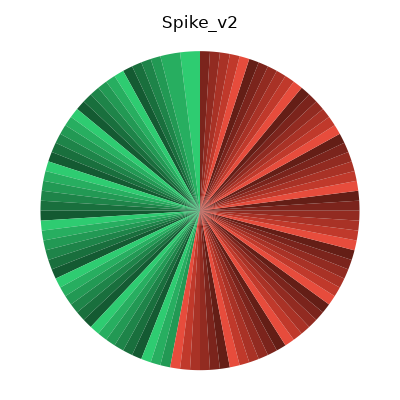
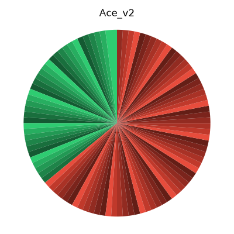

---

## Eevee Evolution
**Goal:** Testing retention of branching evolution knowledge.

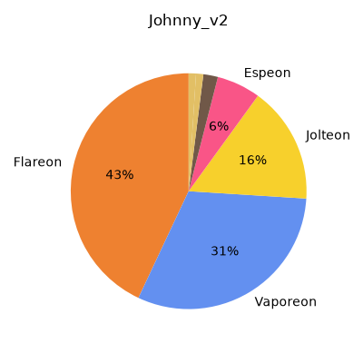
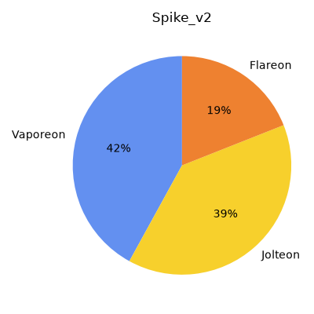
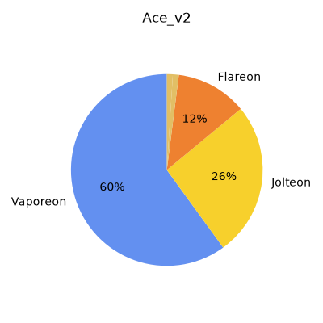

---
